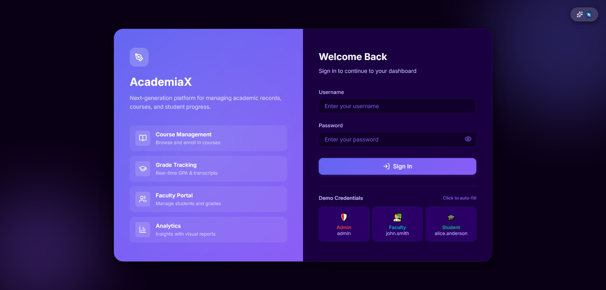
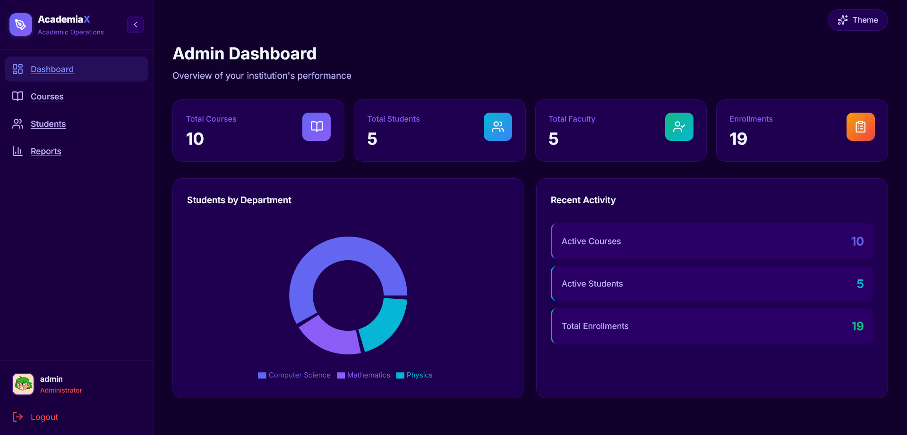
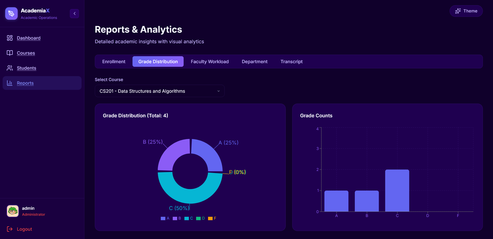

# AcademiaX — Next-Gen Academic & Course Management Platform

[](https://www.oracle.com/java/)
[](https://spring.io/projects/spring-boot)
[](https://react.dev/)
[](https://vitejs.dev/)
[](LICENSE)

**AcademiaX** is a modern, full-stack enterprise Academic & Course Management Platform designed for higher education institutions. Built with a robust **Spring Boot 3** RESTful backend and an interactive **React 19 + Vite** Single Page Application (SPA), AcademiaX enables seamless administration of students, faculty, courses, enrollments, grading workflows, and real-time academic analytics.

---

## 📸 Application Screenshots

### 1. Interactive Single Page Application (SPA) & Authentication Portal


### 2. Admin & Analytics Dashboard


### 3. Reports & Visualized Academic Analytics (Recharts)


---

## 🚀 Key Features & Capabilities

### 🎨 Modern React Frontend (SPA)
- **Interactive Dashboards**: Role-tailored views for Admins, Faculty, and Students with key metrics and quick navigation.
- **Dark & Light Mode Support**: Built-in Theme Context for instant dark/light mode toggle with theme persistence.
- **Dynamic Data Visualization**: Powered by **Recharts** to render interactive grade distribution charts, department stats, and enrollment trends.
- **Global Toast Notification System**: Real-time feedback toasts for user actions (success, error, warning).
- **Responsive Layout**: Designed with modern CSS variables, glassmorphism, flexible grid structures, and **Lucide React** icon set.
- **Modal Workflows**: Sleek modal overlays for adding/editing courses, registering students, and grade submission.

### 🛡️ Spring Boot Backend & Security
- **Role-Based Access Control (RBAC)**: Fine-grained security for `ADMIN`, `FACULTY`, and `STUDENT` roles.
- **RESTful API Architecture**: Modular architecture following Controller-Service-Repository patterns.
- **Interactive OpenAPI / Swagger Documentation**: Auto-generated interactive API playground powered by `springdoc-openapi` (v2.8.8).
- **H2 Database Integration**: Pre-configured file-backed persistent database (`./data/studentdb`) with H2 Web Console access.
- **Automated Data Initializer**: On startup, seeds demo accounts, departments, courses, enrollments, and academic performance data.
- **Robust Security Policies**: BCrypt password hashing, session management, XSS protection, and Content Security Policy (CSP) headers.

---

## 🛠️ Technology Stack

### **Frontend**
| Technology | Role & Description |
| :--- | :--- |
| **React 19** | UI Library for building component-driven SPA |
| **Vite 8** | Next-generation frontend build tool with ultra-fast HMR |
| **React Router DOM v7** | Declarative client-side routing & route protection |
| **Recharts 3** | Interactive charts for academic analytics & grade distributions |
| **Lucide React** | Modern iconography library |
| **Vanilla CSS** | Custom design system supporting Dark/Light themes & glassmorphism |

### **Backend**
| Technology | Role & Description |
| :--- | :--- |
| **Java 21** | Programming Language (LTS version) |
| **Spring Boot 3.5.7** | Application Framework |
| **Spring Security 6** | Role-based authentication, authorization & headers security |
| **Spring Data JPA** | Object-Relational Mapping (ORM) & data persistence |
| **Hibernate** | JPA Provider |
| **SpringDoc OpenAPI 2.8.8** | Swagger UI (`/swagger-ui/index.html`) & OpenAPI 3 specification |
| **Thymeleaf** | Server-side template engine (integrated with Spring Security tags) |
| **H2 Database** | Embedded file-backed relational database (`./data/studentdb`) |
| **Lombok** | Annotations to eliminate boilerplate code |
| **Maven** | Dependency management and build tool |

---

## 📁 Project Structure

```
academiax/
├── frontend/                          # React 19 + Vite Frontend SPA
│   ├── public/                        # Static assets
│   ├── src/
│   │   ├── components/                # Reusable UI components (Modal, Sidebar, StatCard)
│   │   ├── context/                   # React Contexts (AuthContext, ThemeContext, ToastContext)
│   │   ├── layouts/                   # Dashboard & App Layout wrappers
│   │   ├── pages/                     # SPA Page views (Dashboard, Courses, Students, Grades, Reports, Login)
│   │   ├── utils/                     # Utility helpers
│   │   ├── api.js                     # Centralized API fetch layer & backend endpoints integration
│   │   ├── App.jsx                    # Root Routing & Router configuration
│   │   ├── index.css                  # Core CSS Design System & Theme variables
│   │   └── main.jsx                   # React entry point
│   ├── package.json                   # Frontend dependencies & scripts
│   └── vite.config.js                 # Vite server & API proxy setup (port 3000 -> 8080)
│
├── src/                               # Spring Boot Backend Architecture
│   ├── main/
│   │   ├── java/com/academiax/
│   │   │   ├── config/                # SecurityConfig, DataInitializer, Auth Handlers
│   │   │   ├── controller/            # REST Controllers (Auth, Student, Course, Faculty, Grade, Report, Schedule)
│   │   │   ├── dto/                   # Data Transfer Objects
│   │   │   ├── entity/                # JPA Entities (User, Student, Faculty, Course, Enrollment, Grade)
│   │   │   ├── exception/             # Custom Global Exception Handlers
│   │   │   ├── repository/            # Spring Data Repositories
│   │   │   ├── service/               # Business Logic Services
│   │   │   └── validation/            # Custom Input Validators
│   │   └── resources/
│   │       ├── templates/             # Thymeleaf HTML Views
│   │       ├── static/                # Static assets (CSS, JS)
│   │       └── application.properties # Server, Database & JPA Configurations
│   └── test/                          # Unit & Integration Tests
│
├── data/                              # H2 File-backed Database storage
├── AcademiaX.postman_collection.json  # Postman API Collection
├── pom.xml                            # Maven Build Configuration
└── README.md                          # Project Documentation
```

---

## 🔑 Demo Access Credentials

The application automatically seeds realistic data on first startup. You can log in using any of the following pre-configured user accounts:

| Role | Username | Password | Access Privileges |
| :--- | :--- | :--- | :--- |
| **Admin** | `admin` | `Admin@123` | Full access to all endpoints, student/faculty creation, course management & institutional reports. |
| **Super Admin** | `superadmin` | `Admin@123` | Full administrative control. |
| **Faculty** | `john.smith` | `Faculty@123` | Course assignments, grade entry, student performance lookup. |
| **Faculty** | `emily.johnson` | `Faculty@123` | Web Development & DBMS courses management. |
| **Student** | `alice.anderson` | `Student@123` | Personal profile, course enrollment, personal grades & transcript view. |
| **Student** | `bob.baker` | `Student@123` | Student course registrations & GPA tracking. |

---

## 🚦 Getting Started

### Prerequisites

Ensure you have the following installed on your development machine:
- **Java 21** or higher
- **Node.js 18+** & **npm**
- **Maven 3.6+** (or use the included `./mvnw` wrapper)

---

### Step 1: Start the Spring Boot Backend

1. Clone the repository and navigate into the project directory:
   ```bash
   git clone https://github.com/Gulshan-Chouksey/academiax.git
   cd academiax
   ```

2. Build and run the Spring Boot server:
   ```bash
   # On Linux / macOS
   ./mvnw spring-boot:run

   # On Windows PowerShell
   .\mvnw.cmd spring-boot:run
   ```

3. The backend will start on **http://localhost:8080**.

---

### Step 2: Start the React Frontend (Development Mode)

1. Open a new terminal window and navigate to the `frontend` folder:
   ```bash
   cd frontend
   ```

2. Install dependencies:
   ```bash
   npm install
   ```

3. Launch the Vite development server:
   ```bash
   npm run dev
   ```

4. Open your browser and navigate to **http://localhost:3000**.
   > *Note: Vite automatically proxies API requests from `http://localhost:3000/api` to the Spring Boot server at `http://localhost:8080`.*

---

## 📖 Interactive API Documentation (Swagger UI)

AcademiaX features fully integrated OpenAPI documentation powered by **SpringDoc**:

- **Swagger UI Console**: [http://localhost:8080/swagger-ui/index.html](http://localhost:8080/swagger-ui/index.html)
- **OpenAPI v3 Spec (JSON)**: [http://localhost:8080/v3/api-docs](http://localhost:8080/v3/api-docs)

---

## 🗃️ H2 Database Console

To inspect or query the relational database directly:
- **URL**: `http://localhost:8080/h2-console`
- **JDBC URL**: `jdbc:h2:file:./data/studentdb`
- **Username**: `user`
- **Password**: `password`

---

## 📡 API Endpoint Overview

### 🔐 Authentication
| Method | Endpoint | Description | Access |
| :--- | :--- | :--- | :--- |
| `POST` | `/login` | Authenticate user credentials & create session | Public |
| `POST` | `/logout` | Terminate session & clear cookies | Authenticated |

### 👨‍🎓 Students API
| Method | Endpoint | Description | Access |
| :--- | :--- | :--- | :--- |
| `GET` | `/api/students` | Fetch all registered students | Admin / Faculty / Student |
| `GET` | `/api/students/me` | Fetch currently logged-in student profile | Student |
| `GET` | `/api/students/{id}` | Fetch student details by ID | Admin / Faculty / Student |
| `GET` | `/api/students/search` | Search students by keyword | Admin / Faculty |
| `GET` | `/api/students/department/{dept}` | Filter students by academic department | Admin / Faculty |
| `POST` | `/api/students` | Register a new student | Admin |
| `PUT` | `/api/students/{id}` | Update student details | Admin |
| `DELETE` | `/api/students/{id}` | Remove student record | Admin |

### 📚 Courses API
| Method | Endpoint | Description | Access |
| :--- | :--- | :--- | :--- |
| `GET` | `/api/courses` | List all offered courses | Public |
| `GET` | `/api/courses/{id}` | Fetch detailed course information | Public |
| `GET` | `/api/courses/search` | Search courses by title or code | Public |
| `GET` | `/api/courses/semester/{semester}` | Filter courses by semester | Public |
| `GET` | `/api/courses/my-courses` | Get assigned courses for logged-in faculty | Faculty |
| `POST` | `/api/courses` | Create a new course entry | Admin |
| `PUT` | `/api/courses/{id}` | Update course details | Admin |
| `DELETE` | `/api/courses/{id}` | Remove a course | Admin |

### 📝 Enrollments API
| Method | Endpoint | Description | Access |
| :--- | :--- | :--- | :--- |
| `GET` | `/api/enrollments` | List all enrollments | Admin / Faculty |
| `POST` | `/api/enrollments/enroll` | Enroll a student in a course | Admin / Student |
| `GET` | `/api/enrollments/student/{studentId}` | List course enrollments for a student | Admin / Faculty / Student |
| `PUT` | `/api/enrollments/{id}/withdraw` | Withdraw from a course enrollment | Admin / Student |

### 💯 Grades & Performance API
| Method | Endpoint | Description | Access |
| :--- | :--- | :--- | :--- |
| `GET` | `/api/grades/student/{studentId}` | Fetch grades breakdown for a student | Admin / Faculty / Student |
| `GET` | `/api/grades/student/{studentId}/gpa` | Calculate cumulative GPA for a student | Admin / Faculty / Student |
| `GET` | `/api/grades/course/{courseId}` | Fetch all grades for a specific course | Admin / Faculty |
| `POST` | `/api/grades` | Submit internal/external marks for a student | Admin / Faculty |
| `PUT` | `/api/grades/{id}` | Update existing grade record | Admin / Faculty |

### 📊 Reports & Analytics API
| Method | Endpoint | Description | Access |
| :--- | :--- | :--- | :--- |
| `GET` | `/api/reports/enrollment/{courseId}` | Generate enrollment report for a course | Admin / Faculty |
| `GET` | `/api/reports/grades/distribution/{courseId}` | Grade distribution statistics | Admin / Faculty |
| `GET` | `/api/reports/faculty/workload/{facultyId}` | Faculty course workload breakdown | Admin / Faculty |
| `GET` | `/api/reports/department/{dept}` | Departmental overview report | Admin |
| `GET` | `/api/reports/student/transcript/{studentId}` | Generate official academic transcript | Admin / Faculty / Student |

---

## 🧪 Testing & Verification

### Running Backend Unit & Integration Tests
```bash
./mvnw test
```

### API Testing via Postman
A ready-to-use Postman collection is included in the root directory:
- **`AcademiaX.postman_collection.json`**
Import this file into Postman to test and interact with all backend endpoints out of the box.

---

## 🔐 Security & Access Matrix

| Feature / Resource | ADMIN | FACULTY | STUDENT | PUBLIC |
| :--- | :---: | :---: | :---: | :---: |
| **Login / Course Catalog / Swagger Docs** | ✅ | ✅ | ✅ | ✅ |
| **View Own Grades & Enrollments** | ✅ | ✅ | ✅ | ❌ |
| **Course Enrollment & Withdrawal** | ✅ | ❌ | ✅ | ❌ |
| **Submit / Update Grades** | ✅ | ✅ | ❌ | ❌ |
| **Manage Students & Faculty Records** | ✅ | Read Only | Read Only | ❌ |
| **Create & Delete Courses** | ✅ | ❌ | ❌ | ❌ |
| **Institutional Reports & Analytics** | ✅ | ✅ (Limited) | ❌ | ❌ |

---

## 📄 License

This project is open-source software licensed under the [MIT License](LICENSE).

---

## 👤 Author

**Gulshan Chouksey**
- GitHub: [@Gulshan-Chouksey](https://github.com/Gulshan-Chouksey)

---

## 🤝 Contributing

Contributions, issues, and feature requests are welcome! Feel free to check out the [Issues Page](https://github.com/Gulshan-Chouksey/academiax/issues).

*Give a ⭐️ if this project helped you!*
